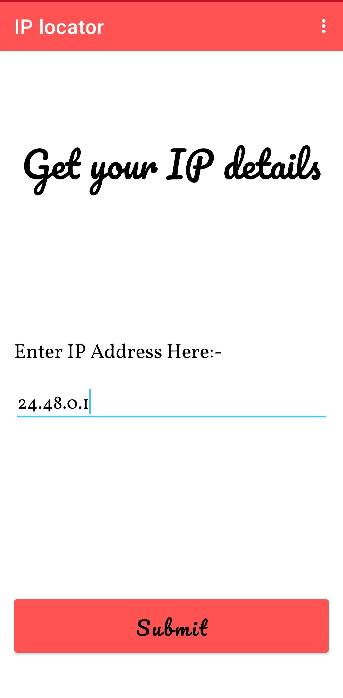
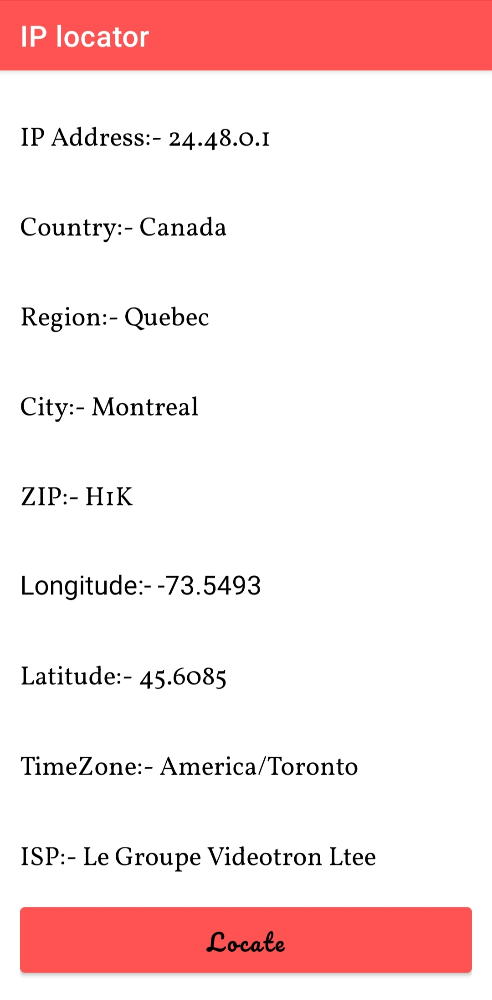
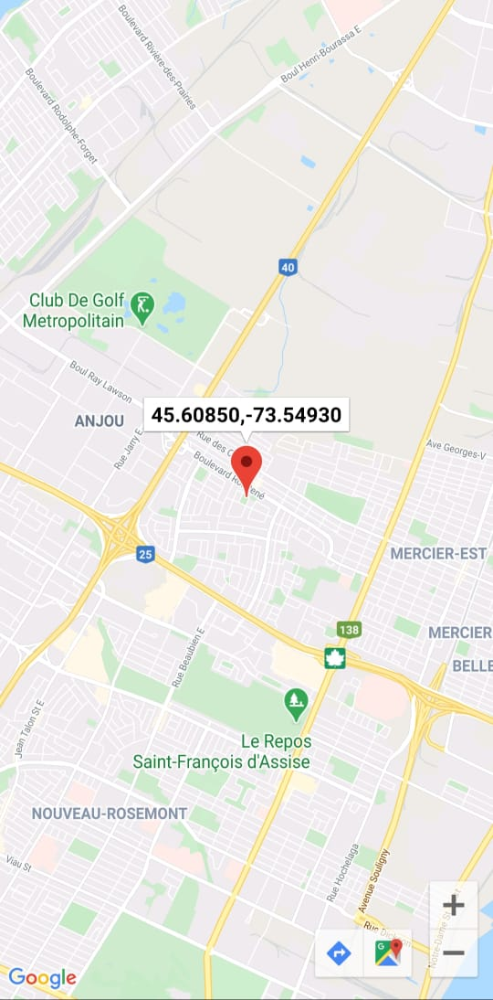

# IP-Locator

Hello Everyone 😊,
I made an Android Application named as "IP Locator" that shows the details of the ip address entered. It supports both Ipv4 and Ipv6 ip addresses. I made this application by using the
following concepts:-
1. API call using Retrofit
2. MVVM Architecture
3. Google Maps API
4. Splash Screen

Here are the glimpse of the UI of the app:-

<h4>Splash Screen</h4>

  

<h4>Home Screen</h4>

  

<h4>Details of the IP Address</h4>

  

<h4>Location on Map</h4>

  

